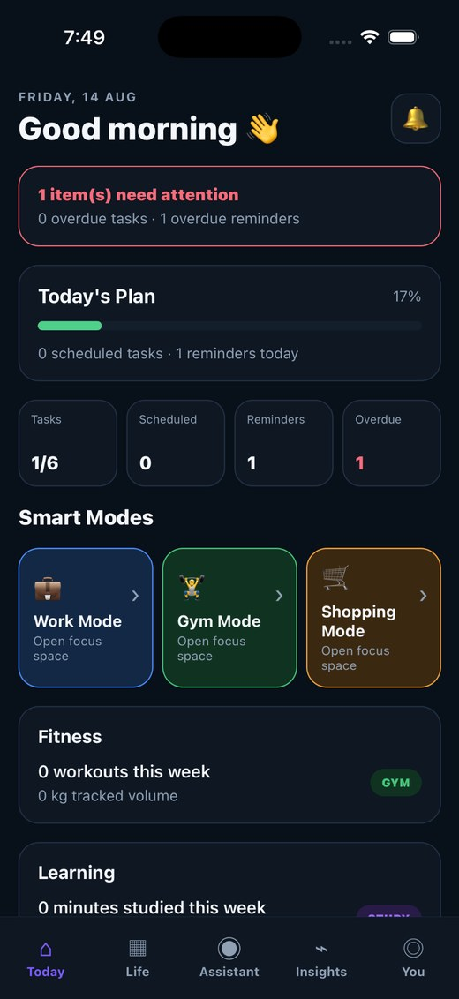
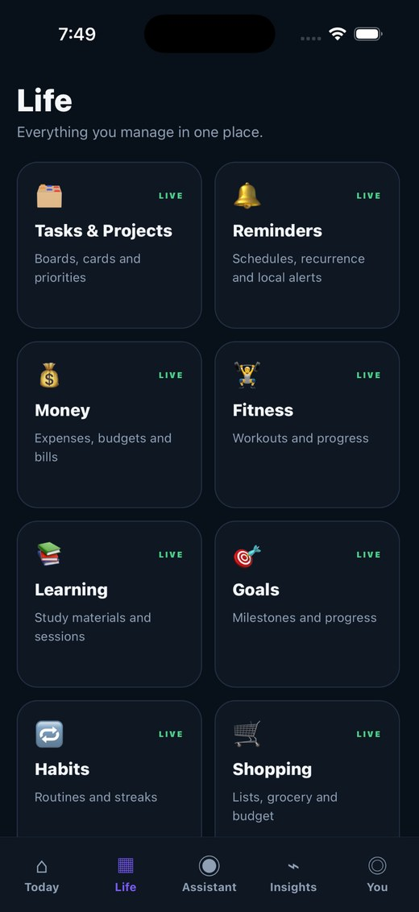
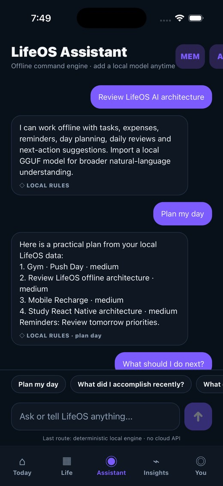
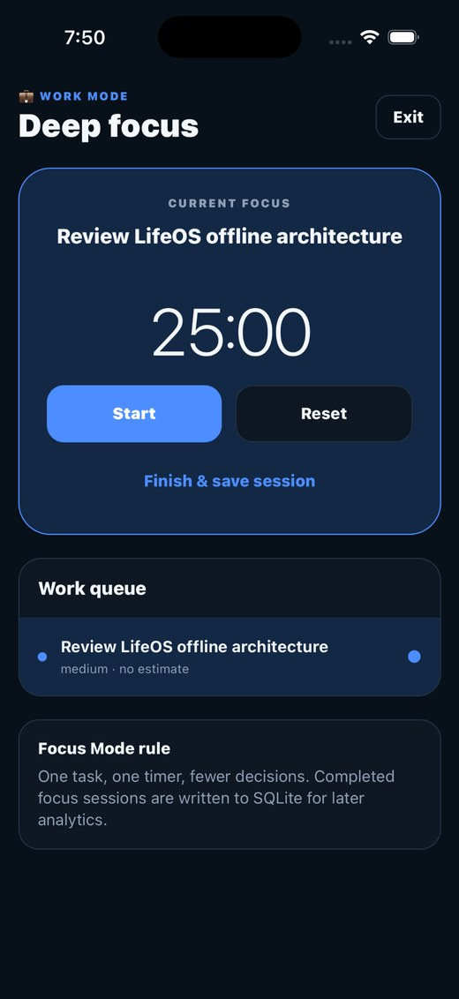
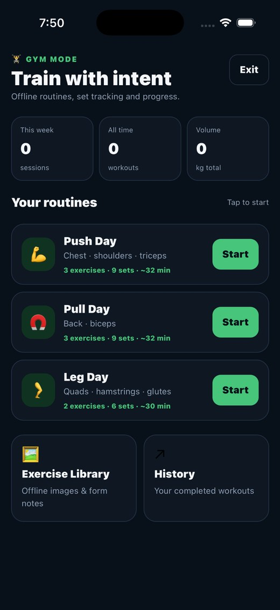
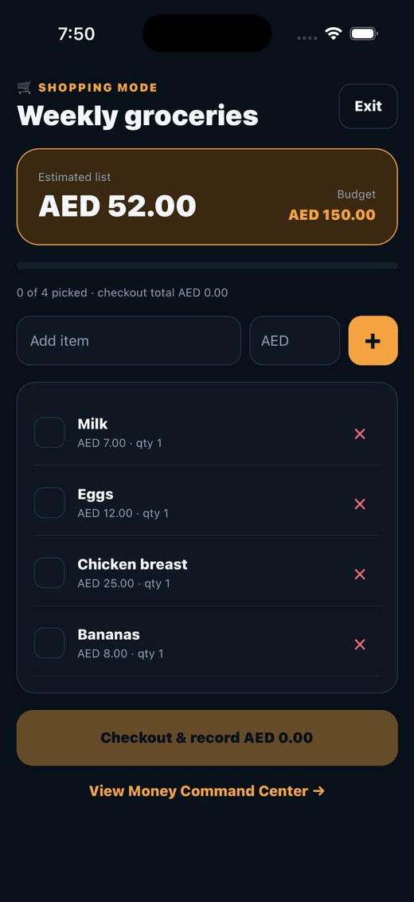
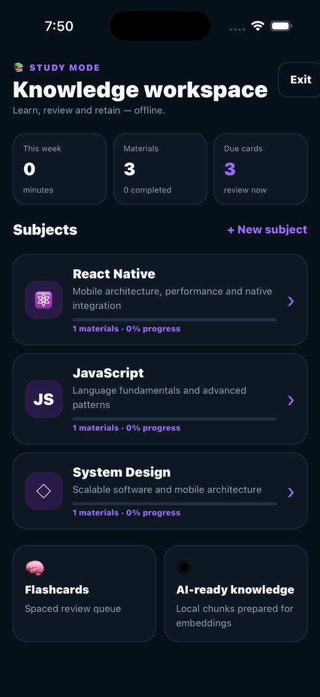
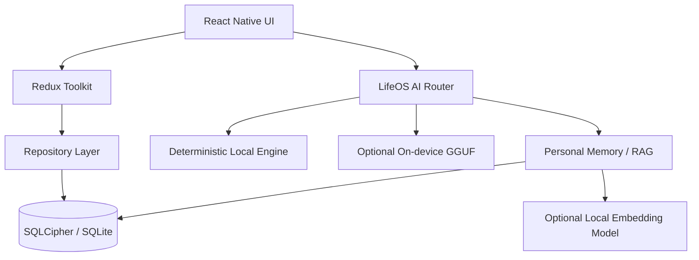

# LifeOS

### Offline-First Personal Intelligence Platform

**Plan. Track. Learn. Improve. Privately.**

LifeOS is a production-oriented **React Native CLI** application that brings daily planning, tasks, reminders, money, shopping, workouts, study, habits, goals, and local AI into one private personal operating system.

The project is designed around a simple principle:

> **Code calculates facts. AI interprets facts.**

Core product features work offline without an AI model or cloud connection. Local AI is an enhancement layer on top of deterministic product logic and SQLite-backed data.

---

## Preview

<p align="center">
  
  
  
</p>

<p align="center">
  
  
  
</p>

<p align="center">
  
</p>

> Screenshots above are from the iOS Simulator. Physical-device and store-release validation are separate release gates.

---

## What LifeOS Does

| Area | Capabilities |
|---|---|
| **Today** | Adaptive daily dashboard, overdue attention, daily plan, schedule and progress summary |
| **Tasks & Projects** | Workspaces, boards, columns, cards, priorities, labels, subtasks and search |
| **Reminders** | Local notifications, recurrence, snooze, overdue handling and linked task scheduling |
| **Work Mode** | Focus queue, 25-minute sessions and persisted focus history |
| **Money** | Accounts, expenses, income, budgets, recurring bills and safe-to-spend calculations |
| **Shopping** | Grocery lists, budgeting and checkout-to-expense integration |
| **Gym** | Push/Pull/Leg routines, sets, reps, weight, PRs, rest timer and workout history |
| **Study** | Subjects, notes, imported materials, focus sessions, flashcards and spaced review |
| **Goals & Habits** | Goals, milestones, streaks, routines, check-ins and daily/weekly reviews |
| **Assistant** | Deterministic offline commands plus optional on-device GGUF models |
| **Personal Memory** | Local RAG over LifeOS data and indexed study knowledge |
| **Security** | SQLCipher, secure key storage, app lock, encrypted backup and privacy controls |

---

## Architecture



### Data ownership

```text
UI
 ↓
Redux UI/cache state
 ↓
Repository layer
 ↓
SQLite / SQLCipher
```

**SQLite is the source of truth.** Redux is not used as the permanent database.

The AI layer never writes directly to SQLite:

```text
Assistant
 ↓
AI Router
 ↓
Validated structured intent
 ↓
Domain repository
 ↓
SQLite
```

That separation keeps AI output from bypassing normal application rules.

---

## Offline-First by Design

LifeOS is useful even when:

- there is no internet connection,
- no local LLM has been downloaded,
- no cloud AI provider is configured.

Tasks, reminders, finance, shopping, workouts, study, goals, habits, routines, analytics and deterministic assistant actions continue to work locally.

The application also maintains a `sync_outbox` foundation so optional encrypted synchronization can be added without changing the local source-of-truth model.

---

## Local AI Assistant

LifeOS has two AI paths.

### 1. Deterministic local engine

Works immediately without downloading a model.

Examples:

```text
Plan my day
What should I do next?
Review my day
Spent AED 38 at Lulu
Add task: Review LifeOS architecture
Remind me tomorrow at 9 to call the garage
```

The deterministic engine converts supported commands into validated domain actions.

### 2. Optional on-device LLM

LifeOS can load a local **GGUF** instruct model through a provider abstraction.

The LLM receives a bounded set of relevant LifeOS facts and returns a structured intent or grounded response. It does not receive unrestricted database access.

Current development workflow supports manual model import. Production UX is intended to move model management behind a simple "Enable Private AI" experience.

---

## Personal Memory & Local RAG

LifeOS can build a private searchable memory from local product data.

```text
Tasks / Reminders / Money / Gym / Study / Goals / Habits
                         ↓
                 Memory documents
                         ↓
          Lexical + semantic retrieval
                         ↓
                 Relevant evidence
                         ↓
             Optional local instruct LLM
                         ↓
              Grounded answer + sources
```

The system supports:

- lexical retrieval without an embedding model,
- optional local embeddings,
- incremental re-indexing,
- vector invalidation when source data changes,
- source-aware answers,
- local query history,
- study-material knowledge chunks.

For Nomic Embed style retrieval, LifeOS uses separate document/query prefixes so document and query embeddings are produced for the correct retrieval task.

---

## Study Material Indexing

The Study workspace supports offline materials such as:

- PDF,
- DOCX,
- plain-text files,
- images as retained study material.

Digital PDFs and DOCX/TXT files can be converted into local knowledge chunks:

```text
Study file
 ↓
Local text extraction
 ↓
Bounded knowledge chunks
 ↓
SQLite
 ↓
Personal Memory
 ↓
Optional semantic embeddings
```

PDF chunks preserve page provenance where extraction can provide it.

Image-only/scanned content is explicitly marked as requiring OCR instead of being silently indexed as empty text.

---

## Security & Privacy

LifeOS treats private personal data as a first-class engineering constraint.

### Database

- SQLCipher-backed SQLite database
- random per-install database secret
- encryption key stored through iOS Keychain / Android Keystore
- plaintext-to-encrypted migration path for existing installs

### App access

- biometric/device authentication support
- optional LifeOS PIN
- configurable auto-lock
- manual lock

### Backup

- encrypted database backup
- separate user backup passphrase
- backup validation before replacement
- rollback-safe restore flow

### AI privacy

- local-first AI architecture
- clear assistant conversations independently
- clear/rebuild semantic embeddings independently
- cloud crash upload disabled by default

---

## Production Hardening

The project includes engineering work beyond feature implementation:

- global React error boundary,
- sanitized local diagnostic events,
- boot/performance metrics,
- database health diagnostics,
- Jest unit tests,
- Jest unit and component tests for selected domain and UI behavior,
- Automated type-check, lint and test workflow through GitHub Actions,
- Android and iOS release builds remain explicit device/release validation gates,
- accessibility checks on shared controls,
- GitHub Actions quality pipeline,
- example device-level Maestro flow,
- performance budgets,
- release checklist.

Current hardening is implemented in code, while physical-device performance, biometric behavior, native AI performance, final archive/AAB builds and store submission remain explicit release-validation steps.

---

## Technology

| Layer | Technology |
|---|---|
| Mobile | React Native CLI |
| Language | TypeScript |
| State | Redux Toolkit |
| Navigation | React Navigation |
| Local database | OP-SQLite |
| Encryption | SQLCipher |
| Local notifications | Notifee |
| Secure storage | iOS Keychain / Android Keystore |
| Local LLM | `llama.rn` provider abstraction |
| Local RAG | SQLite-backed Personal Memory |
| Document import | React Native document picker |
| Testing | Jest + React Native Testing Library |
| CI | GitHub Actions |
| E2E foundation | Maestro |

---

## Domain Modelling Details

A few intentional implementation choices:

- **Money is stored in integer minor units** rather than floating-point currency.
- **Workout weight is stored in grams** to avoid precision problems.
- **Routines represent planned behavior; sessions represent historical activity.**
- **AI never bypasses domain repositories.**
- **Personal Memory is an index, not a second source of truth.**
- **Large GGUF models and user documents are not stored in Redux.**

---

## Project Milestones

| Milestone | Scope |
|---|---|
| M1 | Product shell and adaptive Today experience |
| M2 | Offline repository + SQLite architecture |
| M3 | Tasks, projects and Work Mode |
| M4 | Reminders and Today scheduling |
| M5 | Money and Shopping |
| M6 | Gym / workout system |
| M7 | Study / knowledge workspace |
| M8 | Goals, habits, routines and reviews |
| M9 | Offline AI assistant |
| M10 | Personal Memory + local RAG |
| M11 | Privacy, security and encrypted backup |
| M12 | Production hardening |
| M12.1 | Study document text indexing |

---

## Running the Project

This repository is a React Native CLI project and requires the normal native iOS/Android toolchains.

```bash
npm install
```

For iOS:

```bash
cd ios
bundle exec pod install
cd ..
npm run ios
```

For Android:

```bash
npm run android
```

Start Metro with a clean cache when native/dependency changes require it:

```bash
npm start -- --reset-cache
```

> Local AI models are intentionally not committed to Git. GGUF files should remain ignored because of their size and licensing/distribution considerations.

---

## Repository Safety

Do not commit local or sensitive runtime data such as:

```text
*.gguf
*.sqlite
.env
*.keystore
*.jks
*.p12
*.mobileprovision
*.lifeosbackup
personal study documents
```

---

## Current Status

**Portfolio / engineering build**

The React Native feature roadmap through Study document indexing is implemented. The next work is focused on real-device validation rather than adding another major module:

```text
iPhone + Android physical-device testing
 ↓
Native AI performance validation
 ↓
Accessibility pass with VoiceOver / TalkBack
 ↓
Release profiling
 ↓
iOS archive + Android release build
 ↓
Beta / internal distribution
 ↓
Store-release preparation
```

---

## Why I Built It

LifeOS is not intended to be another collection of disconnected productivity screens.

The engineering goal is to demonstrate how a substantial mobile product can combine:

- offline-first domain architecture,
- native iOS/Android capabilities,
- secure local persistence,
- cross-domain workflows,
- deterministic product logic,
- private on-device AI,
- retrieval-augmented personal memory,
- production testing and release engineering.

It is my flagship project for demonstrating **senior React Native / mobile product engineering**.

---

## License

This project is currently published primarily as a portfolio and engineering case study. Review the repository license before reusing substantial application code.
